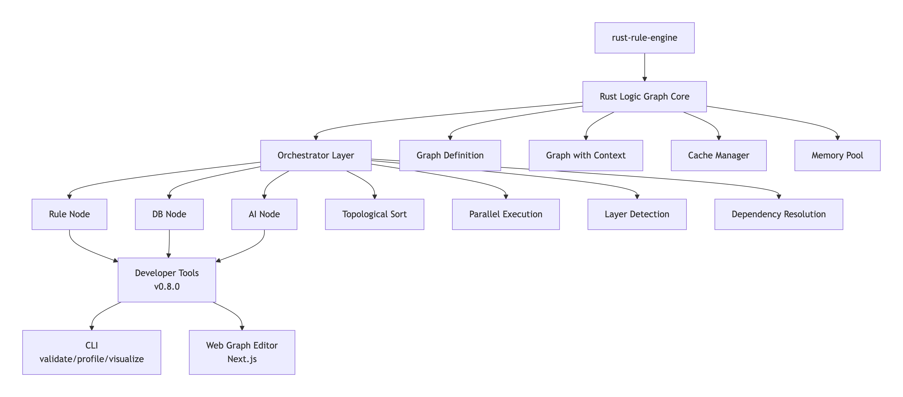

# 🧠 Rust Logic Graph

[](https://www.rust-lang.org/)
[](https://opensource.org/licenses/MIT)

A high-performance **reasoning graph framework** for Rust with **GRL (Grule Rule Language)** support. Build complex workflows with conditional execution, topological ordering, and async processing.

```rust
use rust_logic_graph::{Graph, Orchestrator, GraphIO};

#[tokio::main]
async fn main() -> anyhow::Result<()> {
    let def = GraphIO::load_from_file("workflow.json")?;
    let mut graph = Graph::new(def);
    Orchestrator::execute_graph(&mut graph).await?;
    Ok(())
}
```

---

## ✨ Key Features

- 🔥 **GRL Support** - [rust-rule-engine v0.14.0](https://crates.io/crates/rust-rule-engine) with RETE-UL algorithm (2-24x faster)
- 🔄 **Topological Execution** - Automatic DAG-based node ordering
- ⚡ **Async Runtime** - Built on Tokio for high concurrency
- ⚡ **Parallel Execution** - Automatic parallel execution of independent nodes (v0.5.0)
- 💾 **Caching Layer** - High-performance result caching with TTL, eviction policies, and memory limits (v0.5.0)
- 🧠 **Memory Optimization** - Context pooling and allocation tracking (v0.7.0)
- 🛠️ **CLI Developer Tools** - Graph validation, dry-run, profiling, and visualization (v0.5.0)
- 🎨 **Web Graph Editor** - Next.js visual editor with drag-and-drop interface (v0.8.0)
- 📊 **Multiple Node Types** - RuleNode, DBNode, AINode
- 📝 **JSON Configuration** - Simple workflow definitions
- 🎯 **98% Drools Compatible** - Easy migration from Java
- 🌊 **Streaming Processing** - Stream-based execution with backpressure (v0.3.0)
- 🗄️ **Database Integrations** - PostgreSQL, MySQL, Redis, MongoDB (v0.2.0)
- 🤖 **AI/LLM Integrations** - OpenAI, Claude, Ollama (v0.2.0)

---

## 🚀 Quick Start

### Installation

```toml
[dependencies]
rust-logic-graph = "0.7.0"

# With specific integrations
rust-logic-graph = { version = "0.6.0", features = ["postgres", "openai"] }

# With all integrations
rust-logic-graph = { version = "0.6.0", features = ["all-integrations"] }
```

### Simple Example

```rust
use rust_logic_graph::{RuleEngine, GrlRule};

let grl = r#"
rule "Discount" {
    when
        cart_total > 100 && is_member == true
    then
        discount = 0.15;
}
"#;

let mut engine = RuleEngine::new();
engine.add_grl_rule(grl)?;
```

### Web Graph Editor (NEW in v0.8.0)

```bash
# Navigate to graph editor
cd graph-editor

# Install dependencies
npm install

# Run development server
npm run dev
```

Open [http://localhost:3000](http://localhost:3000) to access the visual graph editor.

**[Full Graph Editor Documentation →](graph-editor/README.md)**

### CLI Tools (v0.5.0)

```bash
# Build the CLI tool
cargo build --release --bin rlg

# Validate a graph
./target/release/rlg validate --file examples/sample_graph.json

# Visualize graph structure
./target/release/rlg visualize --file examples/sample_graph.json --details

# Profile performance
./target/release/rlg profile --file examples/sample_graph.json --iterations 100

# Dry-run without execution
./target/release/rlg dry-run --file examples/sample_graph.json --verbose
```

**[Full CLI Documentation →](docs/CLI_TOOL.md)**

### Run Examples

```bash
# Basic workflow
cargo run --example simple_flow

# GRL rules
cargo run --example grl_rules

# Advanced integration
cargo run --example grl_graph_flow
```

---

## 📚 Documentation

| Document | Description |
|----------|-------------|
| **[Graph Editor Guide](graph-editor/README.md)** | Visual web-based graph editor with Next.js (NEW in v0.8.0) |
| **[Memory Optimization Guide](docs/MEMORY_OPTIMIZATION.md)** | Context pooling and allocation tracking (v0.7.0) |
| **[CLI Tool Guide](docs/CLI_TOOL.md)** | Developer tools for validation, profiling, and visualization (v0.5.0) |
| **[Cache Guide](docs/CACHE_IMPLEMENTATION.md)** | Caching layer with TTL and eviction policies (v0.5.0) |
| **[Migration Guide](docs/MIGRATION_GUIDE.md)** | Upgrade guide to v0.14.0 with RETE-UL (v0.5.0) |
| **[Integrations Guide](docs/INTEGRATIONS.md)** | Database & AI integrations (v0.2.0) |
| **[GRL Guide](docs/GRL.md)** | Complete GRL syntax and examples |
| **[Use Cases](docs/USE_CASES.md)** | 33+ real-world applications |
| **[Extending](docs/EXTENDING.md)** | Create custom nodes and integrations |
| **[Implementation](docs/IMPLEMENTATION_SUMMARY.md)** | Technical details |

---

## 🎯 Use Cases

Rust Logic Graph powers applications in:

- 💰 **Finance** - Loan approval, fraud detection, risk assessment
- 🛒 **E-commerce** - Dynamic pricing, recommendations, fulfillment
- 🏥 **Healthcare** - Patient triage, clinical decisions, monitoring
- 🏭 **Manufacturing** - Predictive maintenance, QC automation
- 🛡️ **Insurance** - Claims processing, underwriting
- 📊 **Marketing** - Lead scoring, campaign optimization
- ⚖️ **Compliance** - AML monitoring, GDPR automation

**[View all 33+ use cases →](docs/USE_CASES.md)**

---

## 🏗️ Architecture




---

## 🔥 GRL Example

```grl
rule "HighValueLoan" salience 100 {
    when
        loan_amount > 100000 &&
        credit_score < 750
    then
        requires_manual_review = true;
        approval_tier = "senior";
}

rule "AutoApproval" salience 50 {
    when
        credit_score >= 700 &&
        income >= loan_amount * 3 &&
        debt_ratio < 0.4
    then
        auto_approve = true;
        interest_rate = 3.5;
}
```

**[Learn more about GRL →](docs/GRL.md)**

---

## 📊 Performance

- **RETE-UL Algorithm**: Advanced pattern matching with unlinking (v0.14.0)
- **2-24x Faster**: Than v0.10 at 50+ rules
- **98% Drools Compatible**: Easy migration path
- **Async by Default**: High concurrency support
- **Parallel Execution**: Automatic layer-based parallelism
- **Smart Caching**: Result caching with TTL and eviction policies

---

## 🧪 Testing & CLI Tools

```bash
# Run all tests
cargo test

# Build CLI tool
cargo build --release --bin rlg

# Validate graph
./target/release/rlg validate --file examples/sample_graph.json

# Visualize graph structure
./target/release/rlg visualize --file examples/sample_graph.json

# Profile performance
./target/release/rlg profile --file examples/sample_graph.json --iterations 100

# Dry-run execution
./target/release/rlg dry-run --file examples/sample_graph.json --verbose
```

**Test Results**: ✅ 32/32 tests passing

**[Learn more about CLI tools →](docs/CLI_TOOL.md)**

---

## 📦 Project Status

**Version**: 0.7.0 (Latest)
**Status**: Production-ready with parallel execution, caching, and CLI tools

### What's Working
- ✅ Core graph execution engine
- ✅ **RETE-UL algorithm** (v0.14.0) - 2-24x faster
- ✅ Three node types (Rule, DB, AI)
- ✅ Topological sorting
- ✅ Async execution
- ✅ JSON I/O
- ✅ **Database integrations** (PostgreSQL, MySQL, Redis, MongoDB)
- ✅ **AI integrations** (OpenAI, Claude, Ollama)
- ✅ **Streaming processing** with backpressure and chunking
- ✅ **Parallel execution** with automatic layer detection
- ✅ **Caching layer** with TTL, eviction policies, memory limits (v0.5.0)
- ✅ **Memory optimization** with context pooling (v0.7.0)
- ✅ **CLI Developer Tools** - validate, profile, visualize, dry-run (v0.5.0)
- ✅ **Web Graph Editor** - Next.js visual editor with drag-and-drop (v0.8.0)
- ✅ Stream operators (map, filter, fold)
- ✅ Comprehensive documentation

### Roadmap
- [x] Streaming processing (v0.3.0) - COMPLETED ✅
- [x] Parallel node execution (v0.4.0) - COMPLETED ✅
- [x] Caching layer (v0.5.0) - COMPLETED ✅
- [x] CLI Developer Tools (v0.5.0) - COMPLETED ✅
- [x] RETE-UL upgrade (v0.5.0) - COMPLETED ✅
- [x] Memory Optimization (v0.7.0) - COMPLETED ✅
- [x] Web Graph Editor (v0.8.0) - COMPLETED ✅
- [ ] GraphQL API (v0.9.0)
- [ ] Production release (v1.0.0)

**See [ROADMAP.md](ROADMAP.md) for details**

---

## 🤝 Contributing

Contributions welcome! Please:

1. Fork the repository
2. Create your feature branch
3. Write tests for new features
4. Submit a pull request

---

## 📖 Examples

| Example | Description | Lines |
|---------|-------------|-------|
| `simple_flow.rs` | Basic 3-node pipeline | 36 |
| `advanced_flow.rs` | Complex 6-node workflow | 120 |
| `grl_rules.rs` | GRL rule examples | 110 |
| `grl_graph_flow.rs` | GRL + Graph integration | 140 |
| `postgres_flow.rs` | PostgreSQL integration | 100 |
| `openai_flow.rs` | OpenAI GPT integration | 150 |
| `streaming_flow.rs` | Streaming with backpressure | 200 |
| `parallel_execution.rs` | Parallel node execution | 250 |

### CLI Tool Examples (v0.5.0)

| File | Description |
|------|-------------|
| `examples/sample_graph.json` | Linear workflow with 5 nodes |
| `examples/cyclic_graph.json` | Graph with cycle for testing |
| `examples/sample_context.json` | Sample input data |

**See [CLI_TOOL.md](docs/CLI_TOOL.md) for usage examples**

---

## 🌟 Why Rust Logic Graph?

### vs. Traditional Rule Engines
- ✅ **Async by default** - No blocking I/O
- ✅ **Type safety** - Rust's type system
- ✅ **Modern syntax** - GRL support
- ✅ **Graph-based** - Complex workflows

### vs. Workflow Engines
- ✅ **Embedded** - No external services
- ✅ **Fast** - Compiled Rust code
- ✅ **Flexible** - Custom nodes
- ✅ **Rule-based** - Business logic in rules

---

## 📝 Changelog

### v0.5.0 (2025-11-06) - Performance & Developer Tools Release

**Breaking Changes:**
- ⚡ **Upgraded rust-rule-engine** from v0.10 → v0.14.0
  - Now uses RETE-UL algorithm (2-24x faster)
  - Better memory efficiency
  - Improved conflict resolution
  - See [Migration Guide](docs/MIGRATION_GUIDE.md)

**New Features:**
- 🛠️ **CLI Developer Tools** (`rlg` binary)
  - Graph validation with comprehensive checks
  - Dry-run execution mode
  - Performance profiling with statistics
  - ASCII graph visualization
  - See [CLI Tool Guide](docs/CLI_TOOL.md)
- 💾 **Caching Layer** - High-performance result caching
  - TTL-based expiration
  - Multiple eviction policies (LRU, LFU, FIFO)
  - Memory limits and statistics
  - See [Cache Guide](docs/CACHE_IMPLEMENTATION.md)
- ⚡ **Parallel Node Execution** - Automatic detection and parallel execution
  - Layer detection algorithm using topological sort
  - Concurrent execution within layers
  - Parallelism analysis and statistics
- 📊 **ParallelExecutor** - New executor with parallel capabilities
- 📝 **New Examples** - CLI examples and test graphs
- ✅ **32 Tests** - Comprehensive test coverage

**Improvements:**
- Updated documentation with CLI tools, caching, and migration guides
- Performance benchmarking utilities
- Example graph files for testing

**Compatibility:**
- All 32 tests passing
- API is backward compatible (100%)
- Performance: 2-24x faster rule matching

### v0.3.0 (2025-11-03) - Streaming & Performance Release

**New Features:**
- 🌊 **Streaming Processing** - Stream-based node execution
  - Backpressure handling with bounded channels
  - Large dataset support with chunking
  - Stream operators (map, filter, fold, async map)
- 📝 **New Example** - `streaming_flow.rs` with 6 demonstrations
- ✅ **8 New Tests** - Streaming module testing

**Performance:**
- Processed 10,000 items in chunks
- ~432 items/sec throughput with backpressure

### v0.2.0 (2025-11-02) - Integrations Release

**New Features:**
- 🗄️ **Database Integrations** - PostgreSQL, MySQL, Redis, MongoDB
- 🤖 **AI/LLM Integrations** - OpenAI GPT-4, Claude 3.5, Ollama
- 📝 **Integration Examples** - `postgres_flow.rs`, `openai_flow.rs`
- 📚 **INTEGRATIONS.md** - Comprehensive integration guide
- 🎛️ **Feature Flags** - Optional dependencies for integrations

### v0.1.0 (2025-11-01) - Initial Release

**Core Features:**
- 🧠 Core graph execution engine
- 🔥 GRL (Grule Rule Language) integration
- 🔄 Topological sorting
- ⚡ Async execution with Tokio
- 📊 Three node types (Rule, DB, AI)
- 📝 JSON I/O for graphs
- 📚 4 working examples
- ✅ 6/6 tests passing

---

## 📄 License

MIT License - see [LICENSE](LICENSE) for details.

---

## 🔗 Links

- **Repository**: https://github.com/KSD-CO/rust-logic-graph
- **rust-rule-engine**: https://crates.io/crates/rust-rule-engine
- **Documentation**: [docs/](docs/)
- **Issues**: [GitHub Issues](https://github.com/KSD-CO/rust-logic-graph/issues)

---

## 👥 Authors

**James Vu** - Initial work

---

## 🙏 Acknowledgments

Built with:
- [rust-rule-engine v0.14.0](https://crates.io/crates/rust-rule-engine) - GRL support with RETE-UL
- [Tokio](https://tokio.rs/) - Async runtime
- [Petgraph](https://github.com/petgraph/petgraph) - Graph algorithms
- [Serde](https://serde.rs/) - Serialization
- [Clap](https://github.com/clap-rs/clap) - CLI framework

---

<div align="center">

**⭐ Star us on GitHub if you find this useful! ⭐**

[Documentation](docs/) • [Examples](examples/) • [Use Cases](docs/USE_CASES.md)

</div>
