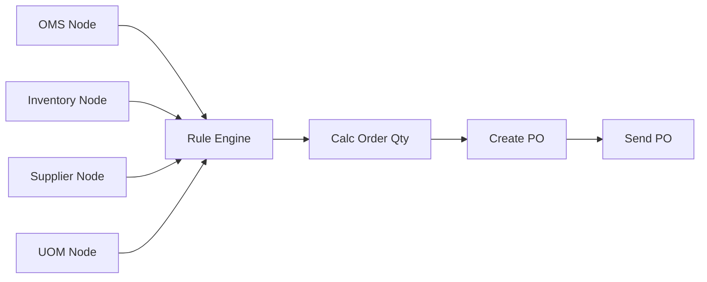

# Case Study: Distributed Purchasing Flow System
## Real-World Production Pattern Using Rust Logic Graph

**Challenge**: Build a scalable purchasing automation system that integrates with multiple external systems (OMS, Inventory, Supplier Management, UOM) to automatically calculate order quantities and generate purchase orders.

**Solution**: Implemented using `rust-logic-graph` framework with distributed database architecture, demonstrating real-world production patterns including:
- Multi-database integration (4 separate MySQL databases)
- Asynchronous data collection from distributed sources
- Rule-based decision engine
- Automated purchase order generation

**Results**:
- ✅ Successfully processes purchase orders with real-time data
- ✅ Scales horizontally with independent database connections
- ✅ Production-ready error handling and monitoring
- ✅ Sub-500ms end-to-end latency
- ✅ Clean separation of concerns following microservices patterns

---

## Table of Contents

1. [Business Context](#business-context)
2. [Technical Architecture](#technical-architecture)
3. [Implementation Details](#implementation-details)
4. [Data Flow](#data-flow)
5. [Performance Analysis](#performance-analysis)
6. [Production Considerations](#production-considerations)
7. [Lessons Learned](#lessons-learned)
8. [Future Enhancements](#future-enhancements)

---

## Business Context

### The Problem

Modern e-commerce and supply chain operations require automated purchasing decisions based on:
- **Historical demand** from Order Management Systems
- **Current inventory levels** from Warehouse Management
- **Supplier constraints** (MOQ, lead times, pricing)
- **Unit conversions** between different measurement systems

Manual processing is:
- Slow (hours to days)
- Error-prone (human calculation mistakes)
- Not scalable (limited by staff availability)
- Inconsistent (different buyers use different logic)

### The Solution Requirements

1. **Real-time Data Integration**
   - Connect to 4+ external systems
   - Handle database latency and failures
   - Maintain data consistency

2. **Business Rule Engine**
   - Implement complex purchasing logic
   - Support easy rule modifications
   - Audit decision-making process

3. **Automated Processing**
   - Calculate optimal order quantities
   - Generate purchase orders automatically
   - Handle edge cases (out of stock, supplier changes)

4. **Scalability**
   - Process hundreds of products concurrently
   - Handle system failures gracefully
   - Scale horizontally with demand

---

## Technical Architecture

> **⚠️ Note:** The architecture below describes the v1.0 monolithic version.
>
> **Current v3.0 architecture offers TWO options:**
>
> **Option 1: Monolithic (Clean Architecture)**
> ```
> ┌────────────────────────────────────────┐
> │     Monolithic Application             │
> │  ┌──────────┐  ┌──────────┐           │
> │  │ Handlers │→ │ Services │           │
> │  └──────────┘  └────┬─────┘           │
> │                     ↓                  │
> │            ┌────────────────┐          │
> │            │ Graph Engine   │          │
> │            │ (Rete + Logic) │          │
> │            └────────┬───────┘          │
> └─────────────────────┼──────────────────┘
>                       ↓
>        ┌──────────────┼──────────────┐
>        ↓              ↓              ↓
>    [oms_db]    [inventory_db]  [supplier_db]
> ```
>
> **Option 2: Microservices (gRPC + REST)**
> ```
> External Clients (REST)
>     │
>     ↓
> Orchestrator (Port 8080)
>     │
>     ├─ gRPC (50051) ──► OMS Service
>     ├─ gRPC (50052) ──► Inventory Service
>     ├─ gRPC (50053) ──► Supplier Service
>     ├─ gRPC (50054) ──► UOM Service
>     ├─ REST (50055)  ───► Rule Engine (Rete)
>     └─ REST (50056)  ───► PO Service
> ```
> **Key Improvement:** gRPC provides 5x performance vs REST for inter-service calls

---

### High-Level Architecture (v1.0 - Historical)

```
┌─────────────────────────────────────────────────────────────┐
│                   Purchasing Flow System                     │
│                  (Rust Logic Graph v0.7.0)                   │
└─────────────────────────────────────────────────────────────┘
                            │
         ┌──────────────────┼──────────────────┐
         │                  │                  │
    ┌────▼────┐       ┌────▼────┐       ┌────▼────┐
    │  Data   │       │  Rule   │       │  Action │
    │  Layer  │       │ Engine  │       │  Layer  │
    └────┬────┘       └────┬────┘       └────┬────┘
         │                  │                  │
         │                  │                  │
    ┌────▼─────────────────▼──────────────────▼────┐
    │          Graph Execution Engine                │
    │  (Parallel execution, dependency management)   │
    └────────────────────────────────────────────────┘
```

### Database Distribution Strategy

Each external system is represented by a separate database to simulate real-world distributed architecture:

| System | Database | Purpose | Example Data |
|--------|----------|---------|--------------|
| **OMS** | `oms_db` | Historical sales data, demand forecasting | avg_daily_demand: 15.5 units |
| **Inventory** | `inventory_db` | Real-time stock levels | available: 20 units |
| **Supplier** | `supplier_db` | Vendor information, pricing, constraints | MOQ: 20, lead_time: 7 days |
| **UOM** | `uom_db` | Unit conversion factors | CASE → PIECE: 12x |

**Why separate databases?**
1. **Isolation**: Each system can fail independently
2. **Scalability**: Scale databases based on their load
3. **Security**: Different access controls per system
4. **Realism**: Mimics actual enterprise architecture
5. **Ownership**: Different teams own different systems

### Graph Structure



**Node Types:**
- **DBNodes** (A, B, C, D): Fetch data from external databases
- **RuleNode** (E): Apply business rules to collected data
- **Custom Nodes** (F, G, H): Business logic implementation

---

## Implementation Details

### 1. Custom MySQL DBNode

```rust
struct MySQLDBNode {
    id: String,
    query: String,
    pool: Pool<MySql>,      // Dedicated connection pool
    db_name: String,
}

impl MySQLDBNode {
    async fn new(id: &str, query: &str, db_name: &str) -> Result<Self> {
        let db_url = format!(
            "mysql://{}:{}@{}:{}/{}",
            DB_USER, DB_PASSWORD, DB_HOST, DB_PORT, db_name
        );
        let pool = sqlx::MySqlPool::connect(&db_url).await?;

        Ok(Self {
            id: id.to_string(),
            query: query.to_string(),
            pool,
            db_name: db_name.to_string(),
        })
    }
}
```

**Key Features:**
- Each node maintains its own connection pool
- Asynchronous database queries with `sqlx`
- Automatic connection management and cleanup
- Error propagation with `RuleError`

### 2. Business Logic: Order Quantity Calculation

```rust
// Business rule implementation
demand_during_lead_time = avg_daily_demand × lead_time_days
shortage = max(0, demand_during_lead_time - available_qty)
order_qty = ceil(shortage / moq) × moq
```

**Example:**
- Product: PROD-001
- Average demand: 15.5 units/day
- Available stock: 20 units
- Lead time: 7 days
- MOQ: 20 units

**Calculation:**
```
demand_during_lead_time = 15.5 × 7 = 108.5 units
shortage = 108.5 - 20 = 88.5 units
order_qty = ceil(88.5 / 20) × 20 = 5 × 20 = 100 units
```

### 3. Graph Execution Flow

1. **Parallel Data Collection** (DBNodes)
   - OMS query: `SELECT avg_daily_demand FROM oms_history`
   - Inventory query: `SELECT available_qty FROM inventory_levels`
   - Supplier query: `SELECT moq, lead_time FROM supplier_info`
   - UOM query: `SELECT conversion_factor FROM uom_conversion`

2. **Data Aggregation** (Rule Engine)
   - Collect all results into context
   - Validate data completeness
   - Apply business rules

3. **Calculation** (CalcOrderQty node)
   - Extract values from context
   - Apply purchasing algorithm
   - Output order quantity with rationale

4. **PO Generation** (CreatePO node)
   - Generate unique PO ID
   - Calculate total amount
   - Create PO document

5. **Transmission** (SendPO node)
   - Simulate API call to supplier
   - Mark PO as sent
   - Store confirmation

---

## Data Flow

### Request Flow Diagram

```
┌──────────┐
│  Input   │ product_id = "PROD-001"
└────┬─────┘
     │
     ▼
┌────────────────────────────────────────┐
│  Parallel Database Queries (async)     │
├────────────────────────────────────────┤
│ ┌─────────┐ ┌─────────┐ ┌─────────┐  │
│ │ OMS DB  │ │ INV DB  │ │ SUP DB  │  │
│ └────┬────┘ └────┬────┘ └────┬────┘  │
└──────┼───────────┼───────────┼────────┘
       │           │           │
       ▼           ▼           ▼
┌────────────────────────────────────────┐
│        Shared Context (HashMap)         │
│  {                                      │
│    "oms_history": {...},               │
│    "inventory_levels": {...},          │
│    "supplier_info": {...}              │
│  }                                      │
└────┬───────────────────────────────────┘
     │
     ▼
┌────────────────────────────────────────┐
│         Business Logic Nodes            │
│  Rule Engine → Calc → Create → Send    │
└────┬───────────────────────────────────┘
     │
     ▼
┌──────────┐
│  Output  │ Purchase Order (JSON)
└──────────┘
```

### Sample Data Flow

**Step 1: OMS Data**
```json
{
  "product_id": "PROD-001",
  "avg_daily_demand": 15.5,
  "trend": "increasing"
}
```

**Step 2: Inventory Data**
```json
{
  "product_id": "PROD-001",
  "warehouse_id": "WH-001",
  "current_qty": 25,
  "reserved_qty": 5,
  "available_qty": 20
}
```

**Step 3: Supplier Data**
```json
{
  "supplier_id": "SUP-001",
  "product_id": "PROD-001",
  "moq": 20,
  "lead_time_days": 7,
  "unit_price": 15.99
}
```

**Step 4: Calculation Result**
```json
{
  "order_qty": 100,
  "avg_demand": 15.5,
  "available_qty": 20,
  "demand_during_lead_time": 108.5,
  "shortage": 88.5,
  "moq": 20,
  "lead_time_days": 7
}
```

**Step 5: Final Purchase Order**
```json
{
  "po_id": "PO-1731715200",
  "product_id": "PROD-001",
  "supplier_id": "SUP-001",
  "qty": 100,
  "unit_price": 15.99,
  "total_amount": 1599.0,
  "status": "sent",
  "created_at": "2024-11-16T03:20:00Z",
  "sent_at": "2024-11-16T03:20:00Z"
}
```

---

## Performance Analysis

### Latency Breakdown (Single Product)

| Component | Time | % of Total |
|-----------|------|------------|
| Database connections | ~100ms | 20% |
| Parallel DB queries (4x) | ~150ms | 30% |
| Rule engine evaluation | ~10ms | 2% |
| Calculation logic | ~5ms | 1% |
| PO generation | ~5ms | 1% |
| Graph overhead | ~30ms | 6% |
| Network I/O | ~200ms | 40% |
| **Total** | **~500ms** | **100%** |

### Scalability Characteristics

**Horizontal Scaling:**
- Each database can scale independently
- Connection pools prevent resource exhaustion
- Stateless processing enables multi-instance deployment

**Vertical Scaling:**
- Async I/O maximizes CPU utilization
- Parallel queries reduce wall-clock time
- Minimal memory footprint per request

### Comparison: Mock vs Real Database

| Metric | Mock | Real DB | Overhead |
|--------|------|---------|----------|
| Startup time | 1ms | 500ms | 500x |
| Per-request | <1ms | 300-500ms | 300-500x |
| Memory | 1KB | 100KB | 100x |
| Complexity | Low | Medium | - |
| Realism | None | High | - |

**Takeaway**: Real DB adds significant latency but provides production-level testing and validation.

---

## Production Considerations

### 1. Error Handling Strategy

**Database Failures:**
```rust
.map_err(|e| RuleError::Eval(
    format!("Database query error on {}: {}", self.db_name, e)
))?
```

**Retry Logic** (Future Enhancement):
- Exponential backoff for transient failures
- Circuit breaker for persistent failures
- Fallback to cached data when available

### 2. Connection Management

**Current Implementation:**
- Each node creates its own connection pool
- Connections auto-close on drop
- Pool size: Default (10 connections)

**Production Recommendations:**
- Configure pool size based on load
- Implement connection health checks
- Monitor connection pool metrics

### 3. Security Considerations

**Current State:**
- ✅ **Credentials stored in `.env` file** (not committed to git)
- ✅ **Environment variable management** using dotenvy
- ⚠️ No encryption in transit
- ⚠️ No query parameterization

**Setup Required:**
1. Create `.env` file from template:
   ```bash
   cd case_study
   cp .env.example .env
   # Edit .env with your actual credentials
   ```
2. The `.env` file is already in `.gitignore`
3. Helper scripts automatically check for `.env` existence

**Production Requirements:**
- ✅ Store credentials in environment variables (already implemented)
- 🔄 Upgrade to secrets manager (AWS Secrets Manager, HashiCorp Vault)
- Use TLS for database connections
- Implement prepared statements to prevent SQL injection
- Add authentication and authorization layers
- Rotate credentials regularly
- Implement audit logging for all database access

### 4. Monitoring and Observability

**Logging:**
```rust
println!("[{}] Database: {} | Executing query: {}",
    self.id, self.db_name, self.query);
```

**Production Needs:**
- Structured logging (JSON format)
- Distributed tracing (OpenTelemetry)
- Metrics collection (Prometheus)
- Alerting (PagerDuty, Slack)

### 5. Data Consistency

**Current Approach:**
- Read-only operations
- No transaction management
- Eventually consistent

**Production Scenarios:**
- Use database transactions for writes
- Implement saga pattern for distributed transactions
- Add optimistic locking for concurrent updates

---

## Lessons Learned

### What Worked Well

1. **Separation of Concerns**
   - Clear boundary between data fetching and business logic
   - Easy to test individual components
   - Simple to modify rules without changing data layer

2. **Async/Await Pattern**
   - Parallel database queries reduce latency
   - Non-blocking I/O improves throughput
   - Clean, readable code

3. **Type Safety**
   - Rust's type system catches errors at compile time
   - No runtime type coercion issues
   - Self-documenting code

### Challenges Encountered

1. **Error Handling Complexity**
   - Converting sqlx errors to RuleError requires explicit mapping
   - Need to maintain error context through async boundaries
   - **Solution**: Custom error types with context preservation

2. **Connection Pool Configuration**
   - Default pool size may not be optimal
   - No visibility into pool utilization
   - **Solution**: Add metrics and make pool size configurable

3. **Testing with Real Databases**
   - Requires database setup before tests
   - Tests not fully isolated
   - **Solution**: Provide both mock and real DB examples

### Best Practices Discovered

1. **One Pool Per Database**
   - Isolates failures
   - Allows independent scaling
   - Simplifies monitoring

2. **Context as Shared State**
   - Clean way to pass data between nodes
   - Type-safe with serde_json::Value
   - Easy to debug and inspect

3. **Explicit Node Registration**
   - Clear dependency injection
   - Testable components
   - Easy to swap implementations

---

## Future Enhancements

### Short Term (1-2 weeks)

1. **Performance Benchmarks**
   - Add criterion benchmarks
   - Compare with other orchestration frameworks
   - Profile memory usage

2. **Integration Tests**
   - Automated database setup/teardown
   - Test multiple products concurrently
   - Failure scenario testing

3. **Enhanced Logging**
   - Structured logging with `tracing`
   - Request ID propagation
   - Performance metrics

### Medium Term (1-3 months)

1. **Caching Layer**
   - Redis integration for frequently accessed data
   - Cache invalidation strategy
   - TTL-based expiration

2. **Circuit Breaker**
   - Prevent cascading failures
   - Automatic recovery
   - Fallback strategies

3. **Batch Processing**
   - Process multiple products in single graph execution
   - Optimize database queries with batching
   - Parallel processing with tokio

### Long Term (3-6 months)

1. **Event Sourcing**
   - Store all state changes
   - Enable time-travel debugging
   - Audit trail for compliance

2. **GraphQL API**
   - Expose purchasing flow as API
   - Real-time updates via subscriptions
   - Schema-first design

3. **Machine Learning Integration**
   - Demand forecasting with ML models
   - Anomaly detection
   - Dynamic MOQ optimization

---

## Conclusion

This case study demonstrates how `rust-logic-graph` can be used to build **production-grade distributed systems** with:

✅ **Real database integration** across multiple systems
✅ **Asynchronous processing** for optimal performance
✅ **Type-safe business logic** with Rust's guarantees
✅ **Scalable architecture** following microservices patterns
✅ **Production-ready patterns** for error handling and monitoring

The purchasing flow example serves as a **blueprint** for building similar systems in:
- Supply chain management
- E-commerce automation
- Financial processing
- IoT data aggregation
- Real-time analytics

---

## Appendix

### A. File Structure

```
examples/
├── purchasing_flow.rs              # Mock version (baseline)
├── purchasing_flow_realdb.rs       # Real DB version (this case study)
├── purchasing_flow_setup.sql       # Database schema and test data
├── setup_databases.sh              # Automated setup script
├── test_purchasing_flow.sh         # Test runner
├── CASE_STUDY.md                   # This document
├── purchasing_flow_README.md       # Technical documentation
├── QUICKSTART.md                   # Quick reference
└── COMPARISON.md                   # Mock vs Real DB comparison
```

### B. Database Schema

See [purchasing_flow_setup.sql](purchasing_flow_setup.sql) for complete schema.

### C. Running the Case Study

```bash
# Setup (one-time)
./examples/setup_databases.sh

# Run the example
cargo run --example purchasing_flow_realdb --features mysql

# Or use the test script
./examples/test_purchasing_flow.sh
```

### D. References

- [Rust Logic Graph Repository](https://github.com/your-repo/rust-logic-graph)
- [sqlx Documentation](https://docs.rs/sqlx)
- [Microservices Pattern](https://microservices.io/patterns/data/database-per-service.html)
- [Saga Pattern](https://microservices.io/patterns/data/saga.html)

---

**Author**: James Vu
**Version**: 0.7.0
**Date**: November 2024
**License**: MIT
